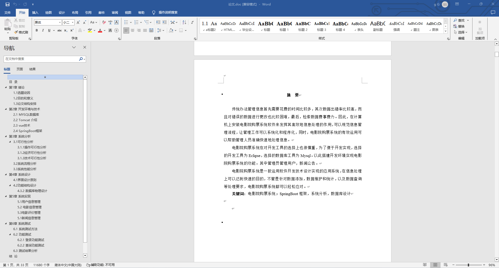
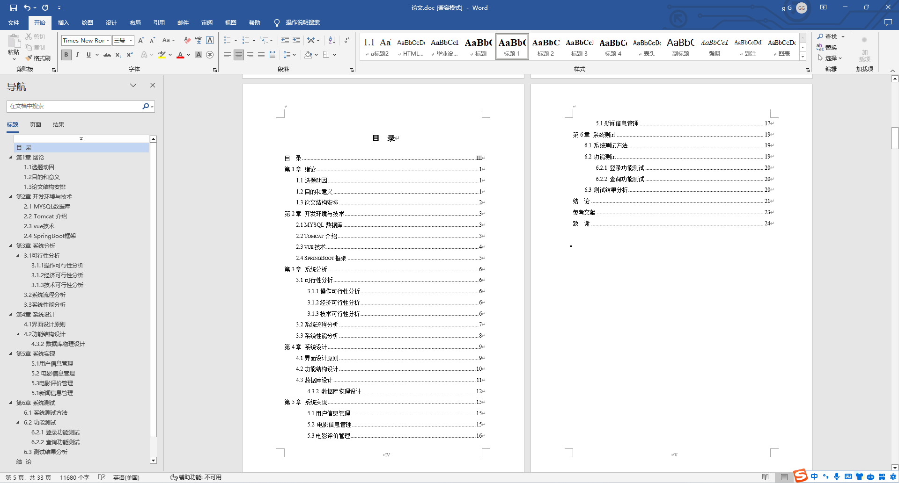
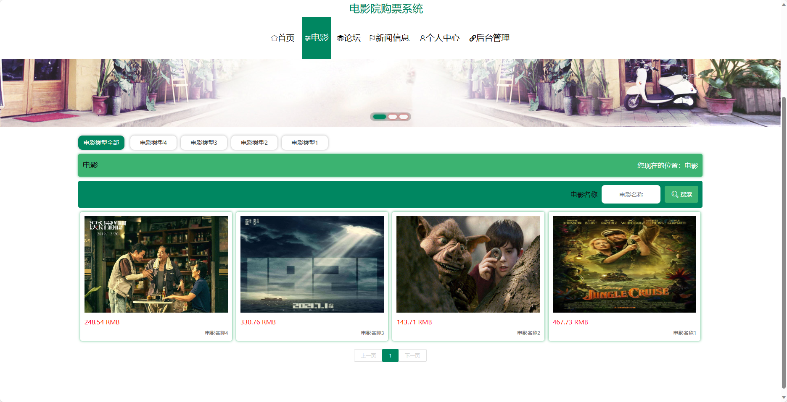
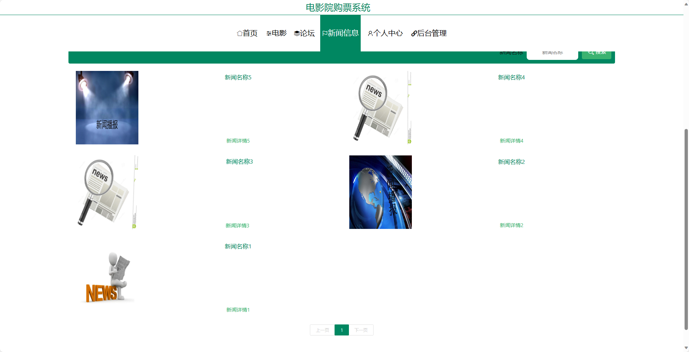
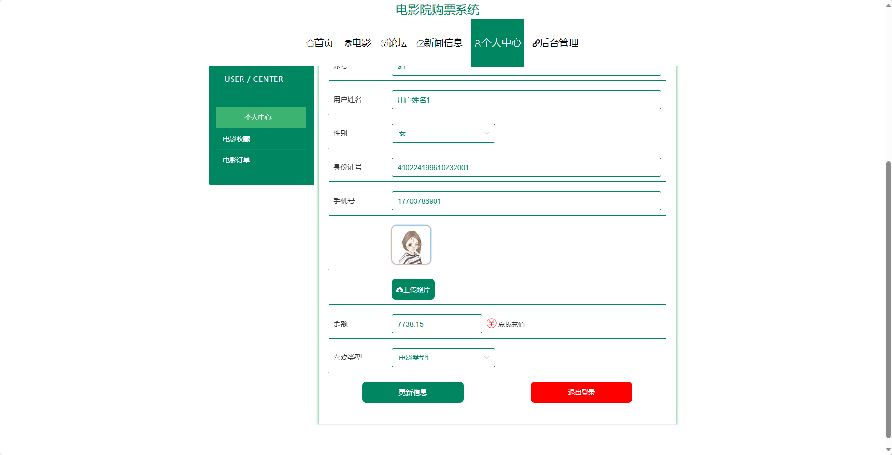
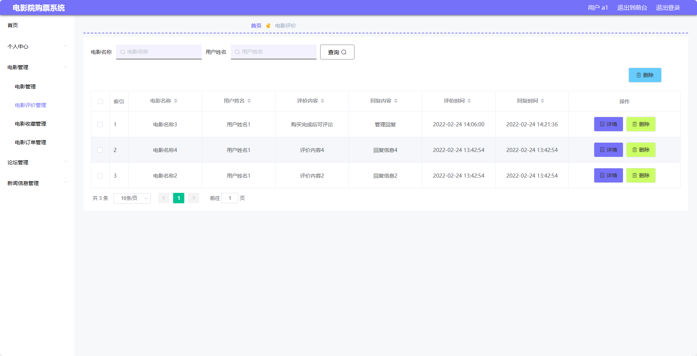
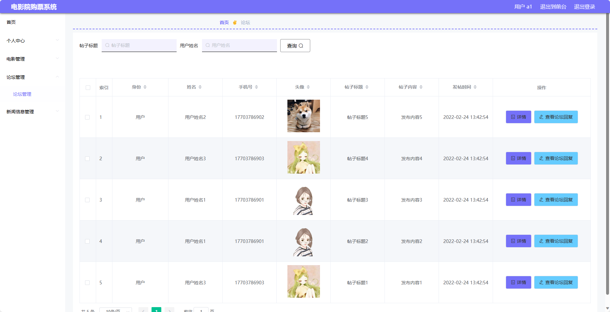
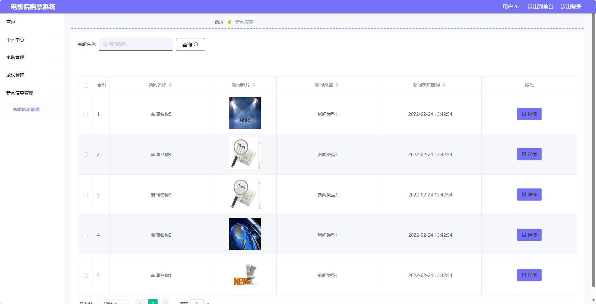
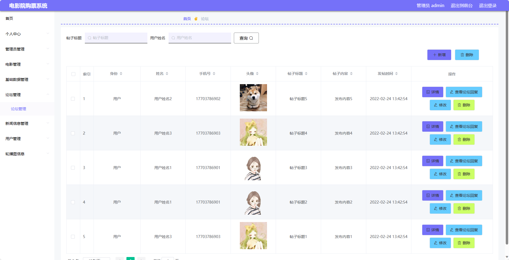

基于SpringBoot的电影院购票系统（程序+论文）
=
- 完整代码获取地址：从戎源码网 ([https://armycodes.com/](https://armycodes.com/))
- 作者微信：19941326836  QQ：952045282 
- 承接计算机毕业设计、Java毕业设计、Python毕业设计、深度学习、机器学习
- 选题+开题报告+任务书+程序定制+安装调试+论文+答辩ppt 一条龙服务
- 所有选题地址https://github.com/nature924/allProject

一、项目介绍
---
基于Spring Boot框架实现的电影院购票系统，系统包含两种角色：管理员、用户,系统分为前台和后台两大模块，主要功能如下。
### 前台：
- 首页：展示系统概要信息。
- 电影：浏览电影列表、查看电影详情。
- 论坛：参与电影讨论的社区。
- 新闻信息：浏览电影相关的新闻资讯。
- 个人中心：管理个人信息。

### 后台：

### 用户：
- 个人中心：管理个人信息。
- 电影管理：管理电影信息，包括添加、编辑、删除电影。
- 论坛管理：管理论坛信息，包括帖子审核、删除等操作。
- 新闻信息管理：管理新闻信息，包括添加、编辑、删除新闻。
  
### 管理员：
- 个人中心：管理个人信息。
- 管理员管理：管理其他管理员的账号信息。
- 电影管理：管理电影信息，包括添加、编辑、删除电影。
- 基础数据管理：管理系统的基础数据，如电影类型、演员信息等。
- 论坛管理：管理论坛信息，包括帖子审核、删除等操作。
- 新闻信息管理：管理新闻信息，包括添加、编辑、删除新闻。
- 用户管理：管理用户信息，包括查看、冻结、删除用户账号。
- 轮播图信息：管理首页轮播图的展示信息。

二、项目技术
---
- 编程语言：Java
- 数据库：MySQL
- 项目管理工具：Maven
- 前端技术：VUE、HTML、Jquery、Bootstrap
- 后端技术：Spring、SpringMVC、MyBatis

三、运行环境
---
- 操作系统：Windows、macOS都可以
- JDK版本：JDK1.8以上都可以
- 开发工具：IDEA、Ecplise、Myecplise都可以
- 数据库: MySQL5.7以上都可以
- Tomcat：任意版本都可以
- Maven：任意版本都可以

四、运行截图
---
### 论文截图：

### 程序截图：

